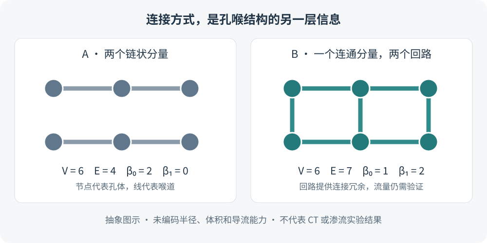

两块岩石具有相近的孔隙度，并不意味着流体能够同样顺畅地通过。孔隙可能彼此孤立，也可能通过细喉连接；一条通道被堵塞后，有的网络仍有替代路径，有的则失去贯通能力。

**拓扑结构关心这些空间单元如何连接。持续同调（persistent homology，PH）进一步追踪：当观察尺度改变时，哪些连接和回路出现，又在哪些尺度消失。** 它为数字岩心提供了一组补充描述量，但这些描述量的地质意义必须通过渗流计算或实验检验。

> 本文是一份文献解读与研究设计笔记。示意图和验证方案由本文整理，不代表已经完成 CT 扫描、渗流模拟或油气充注实验。文中将“论文已经研究的渗透率问题”与“拟用于充注研究的假设”分别说明。

## 1. 先区分几何、拓扑与输运

| 层次 | 主要问题 | 常见描述量 |
|---|---|---|
| 几何 | 孔、喉有多大，形状如何？ | 孔隙度、孔喉半径、比表面积、喉道长度 |
| 拓扑 | 哪些孔连在一起，是否存在回路？ | 连通分量、独立回路、网络配位关系 |
| 输运 | 给定压力和流体条件后，实际如何流动？ | 渗透率、流量分配、突破压力、相对渗透率 |

这三层信息相互关联，却不能互相替代。例如，把一条喉道缩细，只要它仍然存在，抽象网络的连接关系就可以保持不变，而导流能力已经显著改变。因此，仅有“连通”二字不足以判断储层有效性。

### 1.1 三个 Betti 数分别在数什么

对选定的孔隙相构建拓扑对象后，可以用 Betti 数描述不同维度的特征：

- $\beta_0$：连通分量数，即彼此不连通的部分有多少。
- $\beta_1$：独立的一维回路数，即不能通过连续收缩消除的环路有多少。
- $\beta_2$：三维对象中的封闭空腔数。这里指拓扑意义的空腔，不能直接当作“孤立孔隙数”；孤立孔隙首先体现在孔隙相的 $\beta_0$ 中。

这些量依赖于**分析哪一个相，以及如何构建拓扑对象**。孔隙相和固体相不能混用；三维体素复形与抽象孔喉图，也不一定具有相同的高维拓扑。

*图 1　本文绘制的抽象网络示意。圆点代表孔体，线代表喉道；没有编码孔喉半径、体积或导流能力，因此不能由此比较两者的真实孔隙度或渗透率。*

对于只含节点和边、没有填充面的有限无向图，独立回路数可直接计算：

$$
\beta_1=E-V+C
$$

其中 $E$ 为边数，$V$ 为节点数，$C=\beta_0$ 为连通分量数。图 1 左侧有 6 个节点、4 条边、2 个分量，所以 $\beta_1=0$；右侧有 6 个节点、7 条边、1 个分量，所以 $\beta_1=2$。这是图论中的回路计数，**不能直接套到含面和体单元的三维复形上**。

### 1.2 有回路，不等于沿指定方向贯通

一个封闭环可以完全位于样品内部，与入口、出口均不相连；一条无回路的通道则可能贯穿整个样品。因此，除了拓扑特征，还应独立检查孔隙是否连通两端边界，并分别记录 $x$、$y$、$z$ 方向的贯通情况。

这也是实际分析中保留三维位置和原始图像的原因：把结构压缩成一个数字后，方向和空间位置很容易丢失。

## 2. 持续同调：把单次计数变成尺度记录

单一分割结果只能给出一个状态。持续同调通过一组逐渐扩大的集合，记录拓扑特征的产生和消失。每个有限寿命特征对应一对参数：出生值 $b$、死亡值 $d$，其持续度为

$$
p=d-b.
$$

持续图以 $(b,d)$ 表示这些事件；条形码则以区间表示它们。这里的“出生”“死亡”和“寿命”通常是**尺度参数的变化**，不是地质时间，也不是油气运移持续时间。HomCloud 的[三维二值图像教程](https://homcloud.dev/py-tutorial/binary_3d_en.html)展示了从持续图反查图像中的回路和连通结构的方法。

### 2.1 一条容易理解的路线：有符号距离场

设已经把 CT 图像分成孔隙相 $P$ 与固体相 $S$。一种常用约定是：孔隙内部的距离为负，固体内部的距离为正，距离取到另一相的最短欧氏距离：

$$
F(\mathbf{x})=
\begin{cases}
-\operatorname{dist}(\mathbf{x},S), & \mathbf{x}\in P,\\
\operatorname{dist}(\mathbf{x},P), & \mathbf{x}\in S.
\end{cases}
$$

随后构建下水平集 $K_t=\lbrace\mathbf{x}:F(\mathbf{x})\le t\rbrace$。随着 $t$ 增大，集合从孔隙内部较深处逐步扩展，到 $t=0$ 恢复所分割的孔隙相；继续增大，则会进入原先的固体区域。后一过程是数学上的扩张，并不表示矿物真的溶解了。

Robins 等在 [2016 年《Water Resources Research》论文](https://doi.org/10.1002/2015WR017937)中，将微米 CT 图像的拓扑持续性与渗流贯通尺度联系起来，是理解这条路线的重要起点。论文中的不同材料表现也提醒我们：拓扑尺度与输运量之间的关系需要按材料检验。

实际计算必须记录距离定义、像素/体素间距和正负号约定。若坐标按微米计算，$b$、$d$ 和 $p$ 才有相应的长度单位；若直接使用像素索引，得到的首先是像素尺度。另一种滤过若使用距离平方，其参数单位也会随之改变。

### 2.2 长持续度是值得追踪的结构，不是自动成立的渗流结论

相较于短暂出现的特征，长持续度特征通常更值得检查其空间来源。但不能统一解释为“持续度越长，渗透率越高”。一个很稳定的内部环路也可能没有连接出入口。

本文建议把持续图中的代表性点映射回 CT：查看它对应孔体、喉道、固体包围区域，还是样品裁剪边界。HomCloud 的逆分析功能能够辅助这一工作；软件得到的代表环路也不应直接等同于流量最大的通道。

## 3. 2026 年两项研究分别解决了什么

### 3.1 用拓扑描述量改进渗透率预测

Jingrui Liu 等发表于 *JGR: Solid Earth* 的 [Persistent-Homology-Based Descriptors of Pore Heterogeneity for Generalized Permeability Prediction](https://doi.org/10.1029/2026JB035021)，采用的并非直接对二值体素做 PH 的路线，而是：

**连通孔隙 → 孔喉网络 → 节点介数与孔体积加权 → 等效球云 → PH → 渗透率关联。**

研究以六种砂岩、碳酸盐岩的不同大小子体积为对象，使用 HomCloud 对球云进行 α 滤过，重点分析一维回路。作者提出出生多尺度性、持续度水平、持续度多尺度性三个无量纲描述量，并将选定描述量用于 Kozeny–Carman 方程中拓扑项的预测。

其启发是把网络关系纳入结构表征。复现时则必须保留节点加权、球半径映射和滤过定义，不能把普通体素 PH 的均值直接替换成论文指标。节点介数基于最短路径，仍是网络代理量；它本身不是求解压力场后得到的实际流量。该研究也没有直接建立油气充注量预测模型。

### 3.2 用拓扑分析帮助提取孔喉网络

Jie Liu 等发表于 *Advances in Geo-Energy Research* 的 [Topological data analysis for pore-network extraction in porous media](https://doi.org/10.46690/ager.2026.05.01)，研究重点位于前处理环节。其框架结合拓扑数据分析、孔中心之间的路径搜索和中轴线细化来提取孔喉网络，并在模型介质及数字岩心上检验几何与流动响应。

两项研究可以形成方法上的衔接，但不能因为都使用“拓扑”就把算法视为等价：**前者研究结构描述与渗透率映射，后者研究如何获得孔喉网络。** 更换网络提取算法后，还应检查后续特征是否保持稳定。

## 4. 如何开展一个小规模验证

以下是本文建议的探索方案，目标是判断拓扑特征是否在已有几何信息之外增加解释能力。

### 4.1 先整理一张样品主表

若已有约 10—20 个具备配套资料的岩心样品，可先做探索。这个数量不是统计充分性的门槛，更不足以单独支持跨盆地推广。

| 字段 | 需要保留的内容 | 用途 |
|---|---|---|
| 来源 | 井号、深度、母岩心编号、岩性 | 追踪地质差异，确定独立样本 |
| 成像 | 体素尺寸、扫描条件、物理视野大小 | 控制分辨率和观察尺度 |
| 分割 | 阈值/模型、去噪方法、孔隙相定义 | 检查处理方法对连通性的影响 |
| 物性 | 孔隙度、渗透率、方向、测试条件 | 建立基线与验证目标 |
| 可选目标 | 含油饱和度及其测量条件 | 探索充注问题，避免混合不同状态 |

由同一岩心裁出的多个子体积不是多个独立岩心。训练和检验应按母岩心或井分组，避免相邻子体积同时出现在两侧。比较图像时还应统一或明确区分物理视野，而不只比较相同的体素个数。

### 4.2 从两条清楚的技术路线中选一条

| 路线 | 输入与工具 | 适合的起步目标 |
|---|---|---|
| 体素路线 | 二值孔隙、有符号距离场；GUDHI 立方复形或 HomCloud | 观察连接与回路随尺度如何变化 |
| 网络路线 | 提取的孔喉网络；节点、边及几何属性 | 检查网络结构，或按原论文复现加权球云方法 |

体素路线可参考 [GUDHI 立方复形官方文档](https://gudhi.inria.fr/python/latest/cubical_complex_user.html)。三维数组的轴顺序、距离度量、系数域、边界处理都应写进计算记录。常规图像处理中的 6/18/26 邻接与立方复形的相交规则并非天然等价，尤其应检查仅在棱或角处接触的体素。

不要只读取整个滤过终态的 Betti 数：当完整图像区域都被加入后，中间尺度的孔隙结构可能已经消失。需要的是目标参数处的拓扑量，以及各维度的出生—死亡区间。

### 4.3 设置基线，再少量加入拓扑特征

建议先以孔隙度、孔喉尺度和方向贯通孔隙比例建立简单基线，再在**相同划分、相同预测器**上添加少量 PH 特征，例如单位体积的回路数量、有限持续度的分位数或某一预先规定尺度区间内的特征数量。

这些是待检验的候选量，不是已有统一阈值的储层评价指标。应明确如何处理无限死亡值、怎样归一化，以及是否剔除接近分辨率的特征。小样本阶段不要一次生成数百个特征，再从全体样品中筛选与目标最相关的几个。

比较时记录按组验证的误差、预测残差和每个岩心的表现。如果改善只来自某一个岩性，或在留出一个母岩心后消失，就还不能认为拓扑特征具有稳定的增量价值。

### 4.4 对分割与分辨率做一次敏感性检查

在合理范围内改变分割阈值，或对同一样品进行受控降采样，检查贯通状态和特征排序是否改变。若一个体素的细颈决定整个网络是否连接，应回到原图确认它是否可靠。

还应分别保存“全部可识别孔隙”与“贯通孔隙”的结果。先删除非贯通孔隙再研究孤立性，会使问题在前处理阶段就被改变。对于有限视野和周期边界，两种设定回答的问题也不同，应单独报告。

## 5. 从渗透率走向油气充注，还需要哪些证据

将拓扑用于充注研究，可以提出这样的假设：**在孔隙度、岩性和实验条件相近时，网络组织方式是否还能解释含油饱和度或突破过程的差异？** 这是可检验的问题，不能预先写成因果结论。

单相渗透率描述的是给定条件下的导流能力；多相充注还涉及润湿性、界面张力、毛管进入条件、驱替历史和流体供给。现今 CT 所见结构也未必等于古充注时期的结构，成岩作用和后期改造可能改变原有通道。

因此，较稳妥的证据组合是：**拓扑特征 + 同方向渗透率或数值流场 + 可控驱替/毛管压力资料 + 岩相学与成藏约束**。先验证特征与输运响应的关系，再讨论它是否有助于解释油气分布。没有配套实验时，可以报告结构差异和待检验机制，不宜将某个 PH 指标命名为已验证的“充注效率指数”。

## 重要论文与工具链接

1. **Robins, V., Saadatfar, M., Delgado-Friedrichs, O., & Sheppard, A. P.（2016）**. *Percolating length scales from topological persistence analysis of micro-CT images of porous materials*. **Water Resources Research**, 52, 315–329。[论文 DOI](https://doi.org/10.1002/2015WR017937)。适合理解距离场、拓扑持续性与贯通尺度之间的联系。
2. **Liu, J.（Jingrui）等（2026）**. *Persistent-Homology-Based Descriptors of Pore Heterogeneity for Generalized Permeability Prediction*. **Journal of Geophysical Research: Solid Earth**, 131, e2026JB035021。[论文 DOI](https://doi.org/10.1029/2026JB035021)。重点阅读加权球云构建、指标定义与适用样品。
3. **Liu, J.（Jie）, Zhang, T., Duan, Z., Zhang, Y., & Sun, S.（2026）**. *Topological data analysis for pore-network extraction in porous media*. **Advances in Geo-Energy Research**, 20(2), 101–113。[论文 DOI](https://doi.org/10.46690/ager.2026.05.01)｜[期刊页面](https://www.sciopen.com/article/10.46690/ager.2026.05.01)。重点关注孔喉网络提取环节。
4. **HomCloud 材料研究与软件综述**：*Persistent Homology Analysis for Materials Research and Persistent Homology Software: HomCloud*。[作者预印本](https://arxiv.org/abs/2112.03610)｜[官方工具](https://homcloud.dev/en/)｜[三维二值图像教程](https://homcloud.dev/py-tutorial/binary_3d_en.html)。
5. **GUDHI 官方文档**：[立方复形入门](https://gudhi.inria.fr/python/latest/cubical_complex_user.html)｜[API 参考](https://gudhi.inria.fr/python/latest/cubical_complex_ref.html)。用于核对滤过输入、持续区间及 Betti 数的读取方式。

*文献与链接核对日期：2026 年 9 月 23 日。*
