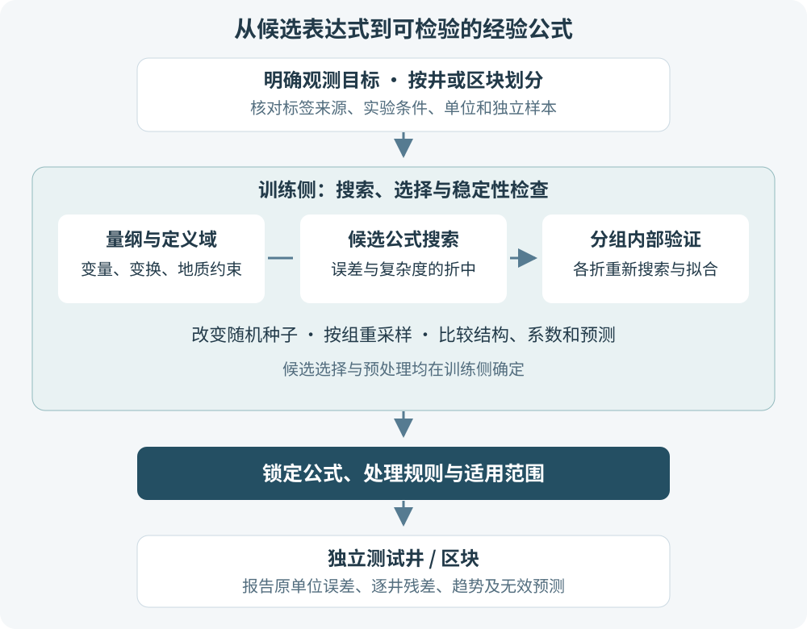

在成藏研究中，我们常有一张不算大的样品表：几十到几百个样品，若干地质、物性或实验参数，以及一个希望预测的目标量。线性关系可能过于简单，随机森林又很难直接写成一条便于检验的经验公式。

**符号回归（Symbolic Regression，SR）提供了另一条路线：同时搜索变量组合、数学运算和系数，寻找能够描述数据的显式表达式。** 研究者可以检查公式的量纲、定义域、变化趋势和敏感性，再用独立井或区块验证其适用性。

它适合探索经验关系，也能生成供其他模型使用的描述符。但一个表达式即使简洁、预测误差小，仍需足够证据才能解释为地质机制。

> 本文结合近期论文整理方法，并提出面向成藏研究的验证方案。示例公式与流程图用于教学；本文没有使用实际井资料进行符号搜索，也没有得到可直接用于生产评价的盖层或断层公式。

## 1. 符号回归究竟在“回归”什么

传统拟合往往先指定形式，例如 $y=ax+b$ 或 $y=ax^b$，再求系数。符号回归则把公式结构也作为搜索对象：变量放在哪个位置，用加法、乘法还是其他运算，是否存在交互项，都可以成为候选。

如果给定变量 $x_1,x_2,x_3$，不同候选可以是：

$$
f_1=a+bx_1,\qquad
f_2=a+bx_1x_2,\qquad
f_3=a+b\frac{x_1}{x_2}+cx_3.
$$

搜索程序需要同时考虑拟合误差与表达式复杂度。用概念性的优化目标表示，就是：

$$
\min_{f\in\mathcal F}\left[\mathcal L_{\mathrm{train}}(f)+\lambda\mathcal C(f)\right].
$$

其中 $\mathcal F$ 是允许的表达式集合，$\mathcal L_{\mathrm{train}}$ 是训练误差，$\mathcal C$ 是复杂度，$\lambda$ 表示对复杂度的取舍。不同算法的实现不完全相同，这个式子用于说明搜索目的，并非所有工具都直接求解这一形式。

常见输出是一组误差—复杂度折中候选，即 **Pareto 前沿**：若一个公式在误差和复杂度上都不优于另一个公式，它就没有必要被优先保留。最终选择仍需依靠训练侧的独立验证，训练误差最低的候选不一定最能泛化。

复杂度也不等于“运算符个数”。变量、常数、表达式树节点和不同运算的代价均可纳入定义，比较模型时应保存实际规则。PySR 使用多种群演化搜索和“演化—简化—优化”循环，其原理见 [Cranmer（2023）的工具论文](https://arxiv.org/abs/2305.01582)。

## 2. 近期研究可以提供哪些启发

### 2.1 小数据材料预测：注意模型究竟输出什么

[Meng 等的钠离子电池正极研究](https://doi.org/10.1021/acs.jpclett.6c02595)提出 Symbol_ETR：先由符号回归构建显式非线性描述符，再与 Extra Trees 回归结合。论文报告平均电压预测的测试 $R^2=0.90$，并与代表性图神经网络比较。

这个结果支持“符号描述符可以帮助小数据建模”的思路。**Symbol_ETR 的最终预测仍包含树集成，不能把该指标当作一条独立闭式公式的性能。** 向地质研究迁移时，应明确目标是获得可直接计算的经验式，还是改善另一种预测器的输入。

该文于 2026 年 8 月 28 日在线发表，收录于 9 月 10 日的期刊卷期。整理近期文献时，在线发表日期与卷期日期需要区分。

### 2.2 显式公式可以进一步做敏感性分析

[Foppa 与 Scheffler（2026）](https://doi.org/10.1103/gk23-cfh1)针对 SISSO 获得的材料描述符，提出基于导数的分析方法。一个关键观察是：不同变量组合可能产生相近精度，并编码相似信息。

对成藏研究的启发是，获得公式后可以分析局部变化趋势，同时检查替代公式是否给出一致解释。变量出现频繁、系数较大，均不能单独证明其具有独立的因果作用。

### 2.3 领域约束可以参与结构搜索

[Stoichiometrically-informed symbolic regression（SISR）](https://doi.org/10.1039/D5DD00470E)从浓度时间序列中识别反应机制，将化学计量约束嵌入搜索，并优化相应动力学参数。

它值得借鉴的是约束的使用方式：先规定哪些候选在领域内成立，再寻找能够解释观测的关系。向地质研究迁移时，可考虑量纲、正值范围和具有证据支持的趋势要求。本文后面的建议是这种思想的应用设想，并非该化学方法已经验证了盖层或断层问题。

### 2.4 地学邻近领域已有显式公式案例

[Yang 等（2026）](https://doi.org/10.1016/j.enggeo.2026.108593)利用包含 1278 个样本的数据库，建立了饱和颗粒土渗透系数的符号回归表达式，并进行了外部资料和实验验证。该研究说明，公式搜索与独立验证可以组成完整的地质材料建模流程。

这里的渗透系数以 m/s 表示，属于水力传导系数；储层研究中常以 m² 或 mD 表示的本征渗透率是另一种物理量。材料类型、流体条件和单位都不同，不能直接套用其系数。

另一个可参考的案例是 [Lazarev 与 Ustyuzhanin（2026）的二维材料缺陷研究](https://doi.org/10.1016/j.matdes.2026.115706)。作者在小规模结构数据上探索可读的相互作用关系，但其精度比较只适用于论文测试的任务，不能推出 SR 普遍优于图神经网络。

## 3. 先选一个有明确观测目标的成藏问题

一个较容易起步的任务，是预测**给定实验条件下的盖层突破压力** $P_c$。可考虑孔隙度 $\phi$、本征渗透率 $K$、泥质含量 $V_{\mathrm{sh}}$，以及具有明确地质意义的其他参数。

若有约 50—150 个已完成测试的样品，可先做历史数据回放；这个范围只是探索规模示例，并不是方法成立的最低样本门槛。真正的独立信息量取决于岩心、井和地质类型的覆盖，不能仅按表格行数判断。

| 项目 | 需要先确定的内容 | 对公式解释的影响 |
|---|---|---|
| 目标 $P_c$ | 流体体系、测试方向、围压、温度、判定规则 | 混合不同测试口径可能产生伪关系 |
| 孔隙度与渗透率 | 测量方法、单位、检出限、应力条件 | 决定变量是否可比较，及变换的定义域 |
| 泥质含量 | 体积分数、质量分数或测井解释值 | 不同定义不能共享一套系数 |
| 埋深 $H$ | 当前埋深、古埋深及其来源 | 埋深是可能的代理变量，不能代替实验围压 |
| 样品来源 | 井、母岩心、层段、岩性、区块 | 决定分组验证与外推范围 |

对断层问题，也可探索断距、SGR、埋深等变量与独立观测量的关系，但应先规定预测的是哪个过程、哪个方向，以及什么时期的状态。

**SGR 应写清为 shale gouge ratio（页岩泥比率）**，其经典定义与滑移层段中的泥质比例有关；它和 shale smear factor（页岩涂抹因子）属于不同指标。可参考 [Yielding 等的断层封闭性研究](https://archives.datapages.com/data/bulletns/1997/06jun/0897/0897.htm)。使用它时需要项目内的地质与压力资料校准。

如果目标指标本身就是用压力差 $\Delta P$ 构造出来的，又把同一个压力差放入输入，模型可能只是重建指标定义。这样的结果不能证明具有独立预测价值，应在搜索前审查输入与标签的来源。

## 4. 量纲与定义域，应当在搜索前处理

### 4.1 对数项需要无量纲的自变量

直接写 $\log K$ 或 $\log(D+1)$，会隐藏单位与参考尺度。若把渗透率从 mD 改为 m²、断距从 m 改为 cm，表达式的数值含义就会改变。

以盖层任务为例，可以先规定正的参考尺度 $P_0,K_0,H_0$，再定义：

$$
p=\frac{P_c}{P_0},\qquad
\kappa=\frac{K}{K_0},\qquad
h=\frac{H}{H_0},\qquad
v=V_{\mathrm{sh}}.
$$

这里 $p,\kappa,h,v$ 都为无量纲量；$v$ 假设以 0—1 的体积分数表示。参考尺度可按明确的物理单位事先约定；若尺度由数据估计，则只能在训练侧拟合并锁定。

以下是**本文用于解释方法的候选形式**，没有经过地质数据拟合：

$$
p=a+b\ln\left(\frac{1}{\kappa}\right)+cvh.
$$

其中 $a,b,c$ 为无量纲待拟合系数，$\ln$ 为自然对数。写成原目标单位，就是 $P_c=P_0p$。明确这些约定，才可能让另一个实验室或区块正确复算。

该式要求 $K>0$。低于检出限的记录不能自动当作真实零值，也不宜为了计算对数而随意加一个很小的常数；应按检测信息预先规定处理方案，并检验结果是否受其影响。

### 4.2 简单运算也会产生不合理表达式

第一轮可从 4—8 个具有地质依据的变量开始，以加、减、乘法及少量受控变换搜索。除法、对数和平方根应在确认定义域后加入；限制变量数量和公式长度是控制探索范围的做法，不是通用最优配置。

| 约束层次 | 建议检查 | 实现上的区别 |
|---|---|---|
| 数学定义域 | 分母是否接近零；对数、根号是否有定义 | 可通过变量变换、运算限制或自定义算子处理 |
| 复杂度 | 表达式大小、深度、嵌套次数 | 搜索工具通常可以直接配置 |
| 输出范围 | 突破压力是否为正，是否出现不合理极值 | 需要目标变换、相应损失或候选审查 |
| 地质趋势 | 在限定条件下，变化方向是否与证据一致 | 需要说明条件，并检查整个适用范围 |

PySR 的 `constraints` 主要控制运算参数子表达式的复杂度，`nested_constraints` 控制嵌套关系。它们本身不会自动保证输出为正或满足单调性。相关选项可从 [官方项目说明](https://github.com/astroautomata/PySR)进入文档核对。

若要求正值，可考虑拟合 $\ln(P_c/P_0)$ 再反变换；这样能够保证反变换后的正值，但误差目标也随之改变。仍应在原压力单位下评价最终误差。

## 5. 一条可以执行的验证流程

*图 1　本文整理的研究流程。候选结构、预处理和选择规则均在训练侧确定；测试井用于评价锁定后的结果。*

### 5.1 划分应先于变量筛选和公式搜索

若目的是预测未见井，先按井划分训练侧与最终测试侧。训练侧再做分组验证，用于比较候选结构、复杂度设置和不同基线。

同一井相邻深度点、同一母岩心切出的多个样品，以及同一次实验的重复测量，应按其相关性组织分组。把相邻样品分别放入两侧，会让公式看起来比实际更能泛化。

如果要验证区块迁移，就留出整个区块；井内验证和区块验证应分别报告。独立井或区块很少时，结果可以支持探索，但外推结论需要与数据覆盖相称。

### 5.2 在相同划分下比较三类模型

| 模型 | 比较目的 | 需要保存的内容 |
|---|---|---|
| 线性、幂律或已有经验式 | 判断新增搜索是否有必要 | 形式、变量变换、拟合范围 |
| 随机森林等参考模型 | 比较灵活预测器的表现 | 调参过程与训练侧验证结果 |
| 符号回归 | 判断能否获得简洁且有竞争力的公式 | 运算集合、复杂度规则、搜索预算、候选表 |

随机森林是比较基线，其精度不是理论上限。三个模型都应使用同一组观测目标和验证划分；若 SR 额外做了大量全数据变量筛选，比较就失去了公平性。

应在训练侧内部验证每个候选。若使用分组交叉验证，预处理、符号结构搜索和系数拟合都要在各折训练数据内进行。先在全部训练侧发现结构，再把这些数据分折，仅重新拟合系数，会低估结构选择带来的偏差。

### 5.3 优先保留可复算的候选表

候选表至少应包含：完整表达式、系数精度、复杂度、训练侧验证误差、定义域检查和趋势检查。可事先规定，在验证误差接近时优先选择更简单的公式；“接近”的尺度应结合测量误差或既定容忍标准确定。

公式和处理规则锁定后，在最终测试井上评价一次。若根据测试结果更换表达式，则该井已经参与选择，不能继续作为同一实验的盲测证据。

## 6. 公式稳定性：区分搜索随机性与样本不确定性

换几个样品便得到完全不同的表达式，是小数据搜索中值得检查的现象。它可能来自数据不足、变量共线、搜索未充分收敛，或者多个表达式在当前范围内几乎等价。

建议分别检查两类扰动：

- **固定数据、更换搜索随机种子**：观察算法本身是否反复返回相近结构或预测。
- **改变训练样本、重新搜索公式**：观察结构、系数和变化趋势是否依赖少数样品。

“每次无放回抽取 80% 样本”属于**重复子采样**；传统 Bootstrap 通常是有放回抽取与原样本量相同的样本。二者回答的问题和统计性质不同，应在方法中如实命名。

具有井内相关性时，可以在训练侧按井或母岩心做簇 Bootstrap：有放回抽取组，再保留其组内观测；重复子采样也应优先按组进行。组数过少时，重采样不能凭空增加独立地质证据。

探索阶段可逐步增加重复次数，例如最终设为 100 次；次数取决于计算预算和统计量是否稳定。每次应采用可比较的搜索预算与选择规则，并记录失败、无效表达式和异常预测。

| 稳定性内容 | 建议记录 | 解释时的限制 |
|---|---|---|
| 变量使用 | 入选频率、替代变量 | 相关变量可能互相替换 |
| 结构组合 | 比值、交互项、变换的频率 | 先做代数简化，不能仅比较字符串 |
| 系数与趋势 | 系数分布、导数方向 | 单位和归一化必须一致 |
| 预测 | 同一预先定义范围内的预测离散度 | 预测稳定不等于结构唯一 |

某个组合在 82/100 次搜索中出现，只能作为稳定性记录，不能解释为“该机制有 82% 的成立概率”。Bootstrap 得到的离散度也不会自动成为具有校准覆盖保证的预测区间；需要区间时，应另行设计和验证，可结合本站的[共形预测方法笔记]()。

## 7. 得到公式后，怎样分析地质敏感性

继续使用第 4 节的教学公式，在其他变量保持不变时：

$$
\frac{\partial P_c}{\partial v}=P_0c\frac{H}{H_0},\qquad
\frac{\partial P_c}{\partial H}=\frac{P_0cv}{H_0},\qquad
\frac{\partial P_c}{\partial K}=-\frac{P_0b}{K}.
$$

第一个导数表示对泥质**体积分数**的敏感性；若报告“泥质含量增加一个百分点”，局部变化量还要乘以 0.01。第二个导数具有压力/长度单位，第三个具有压力/渗透率单位，数值大小不能直接相互比较。

在这个候选形式中，泥质含量的局部效应随 $H/H_0$ 变化。研究时可以据此画出不同埋深条件下的响应曲线，再与实际样品和替代公式比较。

但偏导数描述的是**拟合表达式中的局部关联**。若数据中埋深与泥质含量高度相关，“固定其余变量改变一个变量”可能进入没有样品支持的组合区域。因果解释需要额外的过程或实验约束，不能仅凭公式导数完成。

## 8. 最终需要交付什么

一个可复用的经验关系应同时交付以下内容：

1. **公式与输入规范**：变量定义、单位、参考尺度、对数底数、有效数字，以及缺失值和检出限的处理规则。
2. **适用范围**：岩性、样品条件、变量区间、流体体系和测试条件；超出范围时应明确标记。
3. **验证记录**：训练侧选择过程、最终留出组、原单位下的 MAE/RMSE 与 $R^2$、逐井残差及无效预测数量。
4. **稳定性记录**：随机种子和样本扰动下的结构、系数、趋势与预测变化。
5. **复算材料**：数据字段说明、工具版本、运算与复杂度设置、搜索预算，以及计算公式的脚本或表格。

PySR 可由 Python 调用，搜索后可读取 `model.equations_` 查看候选，并导出符号表达式。其搜索由 Julia 后端执行，首次使用需要配置相应运行环境；通常不需要 GPU，但多轮结构搜索的计算成本仍需按数据和搜索空间评估。安装与使用应以[官方仓库](https://github.com/astroautomata/PySR)和[当前文档](https://pysr.ai/)为准。

对成藏研究，一个有价值的结果可以是：公式在留出井上达到可接受的误差，范围内的趋势合理，样本扰动后仍保留相近的预测与解释。若结构很不稳定，就继续将它作为经验预测候选，并收集能够区分替代解释的新证据。

## 重要论文与工具链接

1. **Cranmer, M.（2023）**. *Interpretable Machine Learning for Science with PySR and SymbolicRegression.jl*。[作者论文](https://arxiv.org/abs/2305.01582)。用于理解搜索过程和工具设计。
2. **Meng, K., Vasenko, A. S., Chulkov, E. V., & Long, R.（2026）**. *From Small Data to High Capacity: Symbolic Learning of Sodium-Ion Cathode Materials*. **The Journal of Physical Chemistry Letters**, 17(36), 10546–10554。[DOI](https://doi.org/10.1021/acs.jpclett.6c02595)｜[PubMed 条目](https://pubmed.ncbi.nlm.nih.gov/42720337/)。注意其符号描述符与树集成的组合方式。
3. **Foppa, L., & Scheffler, M.（2026）**. *How SISSO-derived materials genes shape materials properties: An analytical sensitivity analysis*. **Physical Review Materials**, 10, 093601。[DOI](https://doi.org/10.1103/gk23-cfh1)｜[开放期刊页面](https://journals.aps.org/prmaterials/abstract/10.1103/gk23-cfh1)。关注导数分析与不同描述符的等价信息。
4. **Stoichiometrically-informed symbolic regression for extracting chemical reaction mechanisms from data（2026）**. **Digital Discovery**, 5, 2325–2341。[DOI](https://doi.org/10.1039/D5DD00470E)｜[出版社公开 PDF](https://pubs.rsc.org/en/content/articlepdf/2025/dd/d5dd00470e)。关注领域约束如何参与动态方程搜索。
5. **Lazarev, M., & Ustyuzhanin, A.（2026）**. *Symbolic regression for defect interactions in 2D materials*. **Materials & Design**, 264, 115706。[DOI](https://doi.org/10.1016/j.matdes.2026.115706)｜[作者预印本](https://arxiv.org/abs/2512.20785)。
6. **Yang, Y., Choi, H., Kim, Y., & Kwon, K.（2026）**. *Symbolic regression-based prediction of coefficient of permeability for granular soils*. **Engineering Geology**, 364, 108593。[DOI](https://doi.org/10.1016/j.enggeo.2026.108593)｜[作者机构条目](https://pure.korea.ac.kr/en/publications/symbolic-regression-based-prediction-of-coefficient-of-permeabili/)。关注目标物理量和外部验证。
7. **断层指标背景资料**：*Quantitative Fault Seal Prediction*。[AAPG 原文条目](https://archives.datapages.com/data/bulletns/1997/06jun/0897/0897.htm)。用于核对 SGR、涂抹指标与压力校准的含义。
8. **PySR**：[官方项目](https://github.com/astroautomata/PySR)｜[文档入口](https://pysr.ai/)。

*文献与链接核对日期：2026 年 10 月 3 日。*
