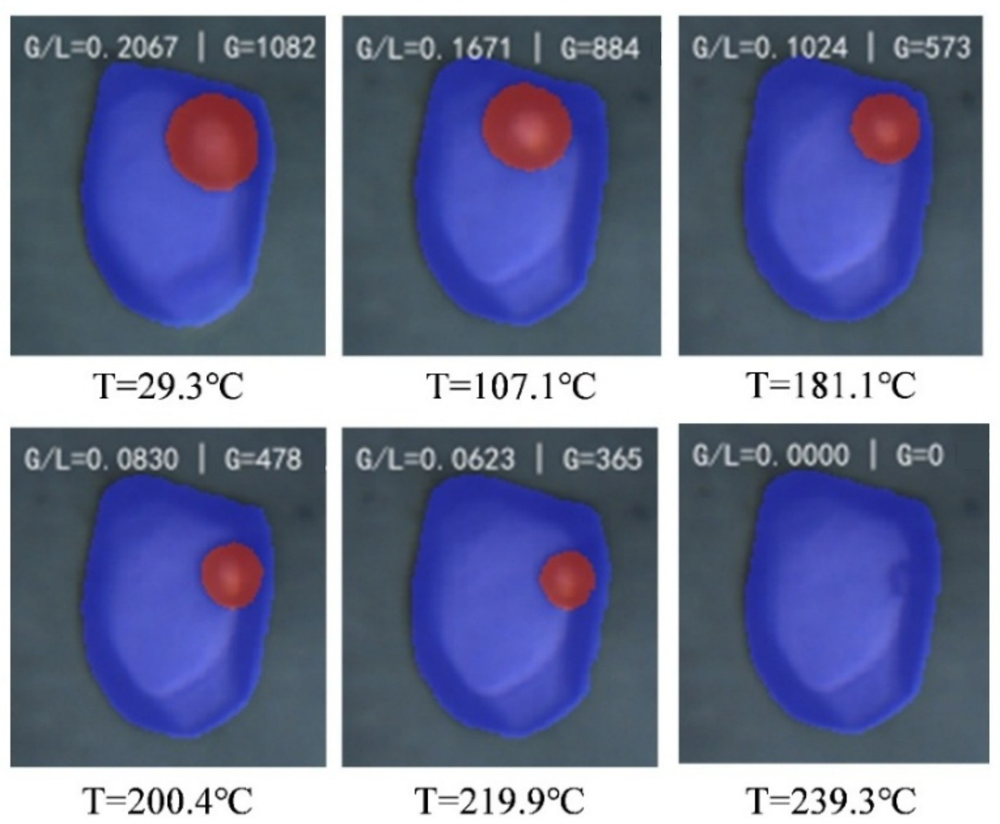

## 方法概述

流体包裹体显微测温中，一个关键操作是持续观察升温过程，判断气液两相何时转变为单相，并记录对应的**均一温度**（homogenization temperature，$T_h$）。对于均一至液相的包裹体，这通常表现为气泡逐渐缩小、最终消失。

机器视觉可以把这一过程转化为可回看的数据链：**显微视频与温度同步 → 包裹体定位 → 气液相分割 → 相态变化监测 → 均一事件判读 → 温度记录与质量评价**。它有望减少持续盯视的工作量，并使不同操作者的判读更容易比较。

2026 年 8 月 28 日公开的发明专利申请 **CN122652064A《基于机器学习的流体包裹体均一温度自动测量系统与方法》**，已经提出了这样的系统。申请人为南京大学和水口山有色金属有限责任公司，申请号为 202611139972.8。可通过[专利公开条目](https://eureka.patsnap.com/patent/CN122652064A)查阅基本信息；本文的系统参数和实施例数据以该申请的公开 PDF 全文为依据。

> 本文是一份方法评述与实验设计笔记。专利报告的结果、外学科论文的结果和本文提出的验证方案分别说明；下文的教学计算不代表本博客已经完成实验。自动判读获得的是显微测温观测量，其成藏意义仍需岩相学、流体性质和埋藏—热演化史共同约束。

## 1. 先明确：程序究竟要识别什么

### 1.1 均一方式决定判读规则

气液两相包裹体的均一方式并不相同，不能全部采用“气泡面积接近零”的规则。

| 均一方式 | 典型可见变化 | 自动判读的重点 |
|---|---|---|
| 均一至液相 | 气泡逐渐缩小，最终不再可见 | 气相区域消失，同时确认目标仍清晰、完整地位于视野内 |
| 均一至气相 | 液相减少，最终液膜消失 | 监测液相及其边界；薄液膜可能难以分辨 |
| 临界均一 | 两相界面逐渐变淡并消失 | 监测弯月面和界面对比度，不能仅依赖气泡面积 |

里尔大学的[均一至液相教学示例](https://fluid-inclusions.univ-lille.fr/co/007_homogenization_liquid_phase_1.html)和[临界均一教学示例](https://fluid-inclusions.univ-lille.fr/co/008_homogenization_critical_phase.html)提供了可直接观看的相变过程。**均一温度不等于热力学临界温度**；只有特定组成、密度条件下才发生临界均一。

对纯水体系，整体密度高于临界密度的包裹体沿相应等容路径升温时可均一至液相，低于临界密度时可均一至气相。专利说明书 [0085] 对高、低密度与均一方向的表述存在颠倒，阅读时应结合相图辨别；本文以实际均一方式定义监测对象。

**初步验证宜限定在成像清晰、相态明确、均一至液相的两相水溶液包裹体。** 烃类、多相或临界均一包裹体可作为后续独立任务，不宜混用同一套阈值。

### 1.2 “气液比”有不同定义

专利说明书 [0076] 定义的是二维气液面积比：

$$
R_{GL}(t)=\frac{A_g(t)}{A_l(t)}
$$

其中，$A_g$、$A_l$ 分别为分割得到的气相和液相像素面积。同一张图像内，也可以定义气相面积分数：

$$
f_g(t)=\frac{A_g(t)}{A_g(t)+A_l(t)}
$$

若包裹体区域只划分为气、液两类，且两式使用相同掩码，则：

$$
f_g=\frac{R_{GL}}{1+R_{GL}},\qquad
R_{GL}=\frac{f_g}{1-f_g}
$$

因此，专利示例中的 $R_{GL}<0.02$ 对应 $f_g<0.0196$，不能写成 $f_g<0.002$。后者是另一套阈值，必须单独验证。

这些量描述的是**二维图像中的分割面积**。它们不自动等于三维气相体积分数，也不能仅凭面积反算包裹体的真实密度。成像焦面、折射和边界识别都会影响测量。对于自动判读，首先需要验证面积变化能否稳定标记相态转变。

## 2. 专利提供了怎样的技术路线

### 2.1 将图像分析接入实验过程

专利把工作分成全局扫描和目标测温两个阶段：先扫描样品、定位包裹体并保存坐标，再选定目标进行升温和连续监测。其核心模块如下。

| 模块 | 专利公开的做法 | 实验中承担的任务 |
|---|---|---|
| 设备控制 | 图形界面自动化、进程间通信、串行通信 | 设置升温程序，读取温度，控制调焦 |
| 图像分析 | 全图目标检测，再对单个目标进行语义分割 | 定位包裹体，区分背景、气相和液相 |
| 动态跟踪 | 检测结果与 CSRT 跟踪器结合，配合回中和调焦 | 减少漂移、失焦与目标丢失 |
| 事件判断 | 分阶段升温、面积比阈值和稳定时间窗口 | 判断是否达到均一状态并记录温度 |

这套方案的价值在于连接了**图像、温度和设备状态**。分割准确只是其中一个环节；目标是否跟丢、温度是否同步、失焦时是否暂停判断，同样决定最终数据是否可靠。

*图 1　CN122652064A 原图 6，原样提取自公开文本 PDF 第 14 页，用于说明气液相分割随升温的变化。原图末帧标注 239.3 ℃，实施例正文报告的判定值为 239.11 ℃；两处分别保留，不能将图片标注视为额外的精度验证。图片来源：李伟强等，南京大学、水口山有色金属有限责任公司，[专利公开条目](https://eureka.patsnap.com/patent/CN122652064A)。*

### 2.2 已公开的实施例与证据边界

说明书 [0090]—[0096] 的样品来自**斑岩铜矿**。下表只转述其公开记录，不将这些结果视为沉积盆地储层样品的验证结果。

| 项目 | 专利报告内容 |
|---|---|
| 全局扫描识别数 | 410 个包裹体 |
| 目标检测指标 | `mAP@0.5` = 82.35% |
| 语义分割指标 | mIoU = 83.91% |
| 升温程序 | 第一阶段 40 ℃/min；180 ℃后切换至 10 ℃/min |
| 图像采集间隔 | 4 s |
| 判定条件 | 气液面积比小于 0.02；稳定时间窗为 3 个采样周期，文中记为 12 s |
| 单目标实施例 | 判定均一温度 239.11 ℃，总测量时间约 15.6 min |
| 连续测温实施例 | 同一薄片的 5 个包裹体，报告均成功判定；平均每个约 14 min |

这里有三个不同的统计对象：**扫描识别了多少个目标、图像模型表现如何、实际完成了多少次自动测温**。410 个检测目标并不意味着完成了 410 次测温验证；mAP 和 mIoU 也不能换算成 $T_h$ 的摄氏度误差。

公开文本尚未提供充分的跨样品独立测试、人工盲判对照和测温误差分布。因此，它支持“已有完整技术方案及实施例”，尚不足以证明该方法在不同矿物、不同流体体系和不同实验室中都具有相同的准确度。记录值保留两位小数，也不意味着测量准确度达到 0.01 ℃。

## 3. 能从热工学气泡研究中借鉴什么

在热工学中，高速视频已被用于连续识别气泡及界面结构，再把图像特征与传热参数关联。

Naderi 等在 2026 年的 [Applied Thermal Engineering 论文](https://doi.org/10.1016/j.applthermaleng.2026.132079)中，研究了水平微通道流动沸腾，处理超过 38 万张图像，比较分割模型并使用 YOLOv8 提取气相及干区分布。对包裹体研究可借鉴的是**逐帧分割、时序跟踪和图像特征的物理核验**。

Sha 等在 2026 年的 [Scientific Reports 论文](https://www.nature.com/articles/s41598-026-35147-8)中，使用高速沸腾视频与 I3D 时空网络估计热流密度。该研究主要提取与沸腾强度有关的视频特征，并不等同于逐颗气泡的精确几何重建，更不是流体包裹体均一温度的验证。

两个领域的物理条件有明显差异：开放或流动系统中的气泡可生长、聚并和脱离，包裹体则受封闭空间和自身组成约束。**可以迁移图像处理思路，不能直接迁移热流预测模型、相变阈值或误差指标。**

另外，Krüger 等的 [2025 年石笋流体包裹体显微测温研究](https://cp.copernicus.org/articles/21/1553/2025/index.html)提供了另一类地学应用实例。其成核辅助测温服务于洞穴古温度重建，具体样品条件和解释模型也不能直接套用于油气藏包裹体。

## 4. 一个容易忽略的问题：稳定窗口会推迟记录时刻

稳定窗口可以降低单帧漏检造成的误判，但要区分两个时间：

- **候选事件时刻 $t_0$**：面积比首次满足条件，且图像质量合格。
- **确认时刻 $t_c$**：后续观察满足稳定窗口，程序确认此前事件有效。

如果等待期间仍以近似恒定速率 $\beta$ 升温，并直接把确认时刻的温度当作事件温度，那么由等待造成的温度增量约为：

$$
\Delta T_{\mathrm{wait}}\approx\beta\tau
$$

其中，$\beta$ 的单位为 ℃/s，$\tau=t_c-t_0$ 的单位为 s。

以专利实施例的第二阶段速率和窗口长度作**教学计算**：

$$
\Delta T_{\mathrm{wait}}\approx
\frac{10}{60}\times12=2.0\ ^\circ\mathrm{C}
$$

同样，4 s 采样间隔对应的相邻观测温度间距约为：

$$
\Delta T_{\mathrm{sample}}\approx
\frac{10}{60}\times4=0.67\ ^\circ\mathrm{C}
$$

**这两项是根据“持续匀速升温”假设得到的量级估算，不是对专利实测误差的测定。** 实际过程中可能存在调焦暂停、保温、温控滞后等情况，应从原始温度日志计算实际温差。

本文建议同时保存候选时刻和确认时刻。通过后续窗口确认事件后，再回看最后明确有气泡与首次持续不可见之间的图像，并保留相应的观测温度区间。这个区间反映图像采样对事件的约束，并非天然包含所有测温误差的置信区间。

还要注意，面积阈值过高会使候选事件早于真正均一，而稳定确认又可能推迟记录。这两种效应不能靠“恰好抵消”实现校准。更高的帧率也只能改善时间采样，不能消除温度标定偏差或样品与传感器之间的热滞后。

## 5. 最小验证方案：先分析录像，再接管设备

以下是本文提出的实施建议，不是专利已经验证的标准流程。对已有冷热台、显微相机和温度记录的实验室，可以先做离线视频分析，验证有效后再开展设备联动。

### 第一步：筛选有岩相学依据的目标

选择约 20—30 个边界清楚、气泡可辨、均一方式明确的两相水溶液包裹体，作为流程摸底。这个规模只能初步发现问题，不能代表广泛适用性验证。

保留宿主矿物、样品位置、包裹体大小、裂隙或生长带关系，以及流体包裹体组合（fluid inclusion assemblage，FIA）归属。FIA 是依据岩相学联系识别的同期捕获组合，不是对温度数据做聚类后得到的任意分组。相关依据见 [Fall 与 Bodnar 的研究介绍及原论文入口](https://www.jsg.utexas.edu/sdi/2019/03/06/fluid-inclusion-assemblages-new-insights/)。

### 第二步：同步视频、温度与实验状态

至少保留原始视频、逐时温度日志、升温程序和标定记录。确认视频时间戳与温度日志的时间基准一致；如有时钟偏移，应记录校正方法。同步误差 $\delta t$ 在近似匀速升温时带来的温差量级为：

$$
\delta T_{\mathrm{sync}}\approx\beta\,\delta t
$$

升温速度应由实验目标、包裹体稳定性和仪器性能决定，并在预计均一范围附近验证较慢速率或分步观测的效果。专利中的 40/10 ℃/min 是其实施例参数，不能直接当作通用测温规程。

### 第三步：人工圈定目标，建立简单基线

第一版可以在 [Fiji/ImageJ](https://imagej.net/software/fiji/) 中人工圈定目标，也可以用 Python 配合 [OpenCV 图像分割工具](https://docs.opencv.org/4.x/d3/db4/tutorial_py_watershed.html)处理视频。

依次完成图像配准、照明检查、候选气泡识别和人工抽查，输出气相面积、包裹体面积及图像质量状态。阈值法、边缘方法或分水岭是否适用，应由实际图像决定；先检验简单方案能否看清均一前最后的小气泡。

**分割失败、目标离开视野、温度缺失和气泡消失必须使用不同状态。** 无效图像不能把气相面积填成零，也不能让程序据此触发均一判定。

### 第四步：建立允许“无法判定”的事件逻辑

对均一至液相的目标，可按以下顺序分析：

1. 确认目标身份、成像质量、包裹体边界和温度记录均有效。
2. 气相面积分数低于经过校准的阈值时，保存候选事件时刻。
3. 在按真实时间戳计算的窗口内继续检查；出现失焦、丢帧或目标丢失时，暂停或重置判定。
4. 窗口通过后回溯检查相变图像，输出候选温度、确认温度、事件观测区间和质量标记。
5. 无法可靠区分微小气泡与图像噪声时，输出“需人工复核”。

窗口应同时满足有效观测数量、最大采样间隔和持续时长要求。例如，只有两帧且相隔很久，不能仅因跨越了指定时长就判为持续稳定。插值可用于对齐有效温度日志，但不能填补不可观测的相变过程。

### 第五步：保留足够复核的结果

| 数据层级 | 建议保存字段 |
|---|---|
| 样品与组合 | 样品编号、薄片编号、宿主矿物、FIA、包裹体编号与位置 |
| 逐帧记录 | 时间戳、温度、气相面积、液相面积、面积比、清晰度及跟踪状态 |
| 判读结果 | 均一方式、候选与确认时刻、事件温度区间、人工复核状态 |
| 实验条件 | 标定记录、升温速率、采样间隔、阈值、窗口、软件或模型版本 |
| 证据文件 | 原始视频、温度日志、关键帧、叠加掩码和异常说明 |

这样得到的数据既能用于统计，也能在发现异常时追溯到原始图像。

## 6. 怎样验证自动判读是否有用

### 6.1 对同一段录像进行独立判读

先让两名实验人员与程序分别判读**同一段视频**，人工判读者不看程序结果，也不看对方答案。这一设计主要检验判读差异，减少重复加热和样品变化的影响。

人工分歧较大的目标应共同复核，并保留“存在争议”的标记；两个人的平均值不是天然真值。随后再结合冷热台标准样标定，以及经检查未发生改变的包裹体重复测量，评价整个实验链的重复性。反复加热本身可能改变包裹体，不能把所有循环默认看作同一对象的无损重复。

### 6.2 同时报偏差、误差与失败率

设程序判读值与经复核的参考值之差为 $d_i=T_{h,i}^{\mathrm{auto}}-T_{h,i}^{\mathrm{ref}}$，则：

$$
\mathrm{Bias}=\frac{1}{n}\sum_{i=1}^{n}d_i,\qquad
\mathrm{MAE}=\frac{1}{n}\sum_{i=1}^{n}|d_i|
$$

Bias 反映整体偏高或偏低，MAE 反映平均绝对差异；二者均是**相对于参考判读**的指标。还应报告：

- 人工之间的分歧、自动与人工之间的差异分布。
- 合格重复实验的离散程度，以及不同升温速度下的结果变化。
- 错误判为均一、漏判均一和主动转人工复核的比例及数量。
- 所有尝试对象数、成功对象数，并按气泡大小、矿物和图像质量分组。
- 自动处理耗时、人工复核耗时和总实验时间。

不能只留下容易成功的大气泡，再报告很低的 MAE。“误差小于 1 ℃”也不是统一验收标准，应依据冷热台性能、人工一致性和具体地质问题预先设定。

### 6.3 参数调整和最终验证分开

阈值、稳定窗口和图像质量规则应在开发样本上确定，再固定参数评价独立样本。将同一包裹体相邻帧随机分到训练集和测试集，会因图像高度相似而高估效果。

若进一步训练深度学习模型，至少按包裹体分组；为了检验实际推广能力，宜保留不同薄片、样品或实验批次作为独立验证。评价还要覆盖均一前的微小气泡，不能仅凭全图平均分割分数作结论。

## 7. 如何进入油气成藏研究

### 7.1 从均一温度到捕获条件

对适用的、均一捕获且后期未改变的水溶液包裹体，$T_h$ 常提供捕获温度的下限约束。估计捕获温度还可能需要成分、盐度、等容线和独立压力信息；异相捕获或后期再平衡则会改变解释条件。相关问题可参考 [Chi 等关于流体包裹体研究常见陷阱的综述](https://doi.org/10.3390/min11010007)。

因此，程序提高的是均一事件的记录能力，不能仅靠视频同时获得捕获压力、盐度和流体组成。盐度通常还需适用体系的低温相变测量，流体组分可结合拉曼等独立分析。

### 7.2 从水溶液包裹体到油气充注事件

对成藏问题，尤其需要判断所测水溶液包裹体是否与烃类包裹体同期捕获。空间上邻近并不足以证明同期，应结合生长带、愈合微裂隙、切割关系及成岩序列建立联系。

在这些依据成立后，再把流体事件的温度约束与埋藏—热演化史匹配。若热史存在多次升温或抬升冷却，同一温度可能对应多个时期，需要加入成岩年龄、构造演化和油气地球化学证据。石油包裹体的纹理、组成和捕获条件如何联合使用，可参考 [Munz（2001）的系统论述](https://doi.org/10.1016/S0024-4937(00)00045-1)。

**温度直方图的两个峰，不能单独证明两期充注。** 应先区分 FIA 和成岩阶段，再评价各组合的温度分布及其不确定性。自动化增加测点数量的同时，更应保留每个测点的岩相学归属。

### 7.3 值得优先检验的成藏问题

对致密砂岩，可先把研究问题限定为：**不同成岩阶段或不同裂隙中的、具有同期含烃证据的包裹体组合，其温度约束是否存在可重复的差异？**

建议将自动判读嵌入以下流程：

**岩相学与 FIA 划分 → 视频测温与质量控制 → 组合内一致性检查 → 捕获条件分析 → 热史匹配 → 充注期次解释。**

如果原始视频足以分辨相变，而且独立验证显示自动判读降低了系统偏差或复核成本，就可以扩展至更多样品。若主要限制来自光学分辨率、样品改变或同期关系不清，应先解决这些问题，再考虑增加模型复杂度。

## 参考资料与专业链接

1. **李伟强、李仕杰、胡卫文、刘腾，2026。**《基于机器学习的流体包裹体均一温度自动测量系统与方法》，发明专利申请公开文本 **CN122652064A**，2026-08-28。申请人：南京大学、水口山有色金属有限责任公司。[公开条目](https://eureka.patsnap.com/patent/CN122652064A)。本文重点核对说明书 [0074]—[0096] 和原图 6；条目平台为检索入口，详细数据依据公开 PDF。
2. **Naderi, F., et al., 2026.** Large-scale vision-based interfacial characterization for heat transfer prediction in horizontal mini-channel flow boiling. *Applied Thermal Engineering*, 303, 132079. [DOI：10.1016/j.applthermaleng.2026.132079](https://doi.org/10.1016/j.applthermaleng.2026.132079)。用于了解气泡图像分割与界面参数提取。
3. **Sha, B. B., et al., 2026.** Machine learning-based heat flux estimation from high-speed video during saturated pool boiling over vertical tube. *Scientific Reports*, 16, 9038. [期刊全文](https://www.nature.com/articles/s41598-026-35147-8)。用于了解视频时空特征与物理量预测。
4. **Krüger, Y., et al., 2025.** Tropical temperature evolution across two glacial cycles derived from speleothem fluid inclusion microthermometry. *Climate of the Past*, 21, 1553–1584. [开放获取全文](https://cp.copernicus.org/articles/21/1553/2025/index.html)。用于了解石笋包裹体测温的实验与解释背景。
5. **Chi, G., Diamond, L. W., Lu, H., Lai, J., & Chu, H., 2021.** Common Problems and Pitfalls in Fluid Inclusion Study: A Review and Discussion. *Minerals*, 11(1), 7. [DOI：10.3390/min11010007](https://doi.org/10.3390/min11010007)。用于核对均一方式、温压解释及常见误区。
6. **Fall, A., & Bodnar, R. J., 2018.** How Precisely Can the Temperature of a Fluid Event be Constrained Using Fluid Inclusions? *Economic Geology*, 113(8), 1817–1843. [DOI：10.5382/econgeo.2018.4614](https://doi.org/10.5382/econgeo.2018.4614)；[作者所在研究团队的解读](https://www.jsg.utexas.edu/sdi/2019/03/06/fluid-inclusion-assemblages-new-insights/)。用于理解 FIA 和流体事件温度的不确定性。
7. **Munz, I. A., 2001.** Petroleum inclusions in sedimentary basins: systematics, analytical methods and applications. *Lithos*, 55, 195–212. [DOI：10.1016/S0024-4937(00)00045-1](https://doi.org/10.1016/S0024-4937(00)00045-1)。用于理解石油包裹体与盆地流体演化的联系。
8. **Université de Lille：The world of fluid inclusions。**[均一至液相](https://fluid-inclusions.univ-lille.fr/co/007_homogenization_liquid_phase_1.html)；[临界均一](https://fluid-inclusions.univ-lille.fr/co/008_homogenization_critical_phase.html)。适合对照视频理解相变现象。

实验图像处理工具：[Fiji/ImageJ 官方入口](https://imagej.net/software/fiji/)；[OpenCV 分水岭分割教程](https://docs.opencv.org/4.x/d3/db4/tutorial_py_watershed.html)。
