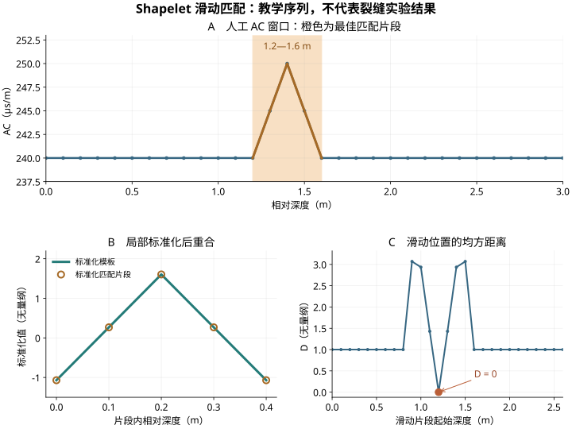

对测井曲线做分类时，均值、标准差和最大值能够概括一段数据，却未必保留异常出现的顺序和形态。一段“增大—恢复”与一段“持续抬升”，即使统计量接近，其解释意义也可能不同。

**Shapelet（判别性子序列，也称形状元）用一小段序列作为模板，将局部形态的相似程度转成特征。** 原本用于时间序列的方法，可以沿测井的深度轴使用：寻找哪些短片段有助于区分带裂缝证据与明确无裂缝证据的窗口。

研究目标可以是建立一份可追溯的形态图版：展示模板的原始来源、匹配井段及跨井表现，再回到岩心、成像测井和仪器质量资料检验其含义。

> 本文是方法整理与研究设计笔记。图和代码使用人工构造序列，只演示距离计算，不代表已经发现了真实裂缝响应。后文的窗口尺度与样本数量属于探索方案，不是通用裂缝判据。

## 1. 一个短片段，怎样成为分类特征

经典 Shapelet 方法从训练序列中抽取候选片段，依据其区分类别的能力筛选；后续方法也可以学习连续参数化的原型。需要区分**来自实际数据的片段**和**优化得到的原型**，因为两者的来源解释不同。

Shapelet 的经典工作可追溯到 [Ye 与 Keogh（2009）](https://doi.org/10.1145/1557019.1557122)。[Hills 等（2014）](https://doi.org/10.1007/s10618-013-0322-1)进一步提出 Shapelet Transform，把序列转换为“到多个模板的距离”，再交给分类器。

设一个测井窗口为 $X=(x_1,\ldots,x_N)$，模板为 $S=(s_1,\ldots,s_L)$，其中 $L\le N$。在窗口内滑动长度为 $L$ 的片段，计算每个位置的差异，再取最小值。

本篇教学示例采用**局部 z 标准化后的均方距离**：

<div class="math-display">
$$
D(S,X)=\min_{1\le j\le N-L+1}
\frac{1}{L}\sum_{i=1}^{L}
\left[Z(S)_i-Z\left(X_{j:j+L-1}\right)_i\right]^2.
$$
</div>

其中 $Z(A)_i=(a_i-\mu_A)/\sigma_A$，均值和总体标准差分别在模板或当前滑动片段内计算，方差分母取 $L$。$D$ 越小，表示至少有一个位置与模板形态越相似；最优位置记为 $j^*$。

这是 [aeon 的 RandomShapeletTransform](https://www.aeon-toolkit.org/en/stable/api_reference/auto_generated/aeon.transformations.collection.shapelet_based.RandomShapeletTransform.html)采用的距离形式。其他实现可能使用欧氏距离、均方根距离或其他度量，应核对定义后再比较数值与阈值。

若保留 $M$ 个模板，一段曲线便可以转为：

<div class="math-display">
$$
\mathbf d(X)=\left[D(S_1,X),\ldots,D(S_M,X)\right].
$$
</div>

再用逻辑回归等分类器处理这组特征。距离小并不自动意味着裂缝：模板可能更常见于负类，也可能反映岩性或仪器条件，其作用需要由训练和验证结果确定。

## 2. 归一化保留了什么，又去掉了什么

### 2.1 局部形状与绝对幅值是两层信息

对模板和每个滑动片段分别做 z 标准化，能够减少基线和正比例幅值变化的影响。某段曲线若满足 $W=a+bS$、$b>0$，标准化后可以与模板完全重合，即使其原始数值差异很大。

这适合研究“形状是否相似”，但会削弱绝对 AC 水平和异常幅度的信息。跨井研究中可以分别比较形态距离、背景值和相对背景的幅度，并在训练侧验证它们是否提供互补信息。

| 处理方式 | 主要比较的信息 | 需要记录的约定 |
|---|---|---|
| 统一单位后比较原始片段 | 形态、基线与幅值共同作用 | 单位、仪器校准和异常幅度 |
| 每个片段局部标准化 | 主要比较形状 | 标准差定义、平坦片段处理 |
| 形态距离加背景特征 | 尝试保留互补信息 | 特征构造与训练侧验证结果 |

上述公式在 $\sigma_A>0$ 时有定义。零方差模板不适合作为形态候选；近乎平坦的片段也容易把微小噪声放大。实际分析应先规定与数据精度相称的处理规则。

### 2.2 一张可以复算的滑动匹配图

下面人为构造一段 0—3 m 的 AC 窗口，采样间隔为 0.1 m，在 1.2—1.6 m 放置一个短峰。模板为 $S=(0,1,2,1,0)$，对应原始片段为 $(240,245,250,245,240)$。

两者经过局部标准化后相同，因此该位置的 $D=0$。这只说明模板与片段的匹配关系，不说明短峰由裂缝引起。



*图 1　人工教学序列。橙色区间为最佳匹配片段；距离曲线的横轴表示每个滑动片段的起始深度。平坦片段在本演示中标准化为零向量。*

以下代码仅计算一个已给定模板的距离和位置，**没有执行模板学习或裂缝分类**：

```python {style="monokai"}
from math import isfinite
from statistics import mean, pstdev

def z_norm(values):
    mu, sd = mean(values), pstdev(values)
    if sd <= 1e-12:
        return [0.0] * len(values)
    return [(v - mu) / sd for v in values]

def shapelet_match(series, template):
    x, s = list(map(float, series)), list(map(float, template))
    n, length = len(x), len(s)
    if length < 2 or n < length:
        raise ValueError("模板至少两点，且不能长于待匹配序列")
    if not all(isfinite(v) for v in x + s):
        raise ValueError("请先处理缺失值和无效值")
    if pstdev(s) <= 1e-12:
        raise ValueError("不使用零方差模板")
    s_norm = z_norm(s)
    distances = []
    for start in range(n - length + 1):
        window = z_norm(x[start:start + length])
        distances.append(sum((a - b) ** 2
                             for a, b in zip(s_norm, window)) / length)
    best = min(range(len(distances)), key=distances.__getitem__)
    return distances[best], best

x = [240.0] * 31
x[12:17] = [240, 245, 250, 245, 240]
s = [0, 1, 2, 1, 0]
distance, start = shapelet_match(x, s)
print(f"D={distance:.6f}, 起始索引={start}")
```

输出为 `D=0.000000, 起始索引=12`。Python 使用从 0 开始的索引；在此例的深度轴上，索引 12 对应 1.2 m。若存在多个同样的最小值，这段代码返回最早的位置，实际报告时还可保留全部匹配位置。

代码中的 `1e-12` 只是数值演示的退化处理阈值，不是测井质量标准。生产资料还需要处理无效码、间断、异常尖点及仪器问题。

## 3. 从时间轴换到深度轴，物理尺度必须重建

### 3.1 点数相同，不代表尺度相同

若模板有 $L$ 个采样点、统一间隔为 $\Delta z$，本篇按首末采样点之间的跨度定义长度：

<div class="math-display">
$$
\ell=(L-1)\Delta z.
$$
</div>

在 $\Delta z=0.1$ m 时：

| 首末点跨度 $\ell$ | 模板点数 $L$ |
|---|---|
| 0.2 m | 3 |
| 0.4 m | 5 |
| 0.6 m | 7 |
| 0.8 m | 9 |
| 1.0 m | 11 |

有的处理流程按每个采样点代表一个深度单元，以 $L\Delta z$ 计长度。两种约定都应写清；图版最好同时报告点数、采样间隔及实际首末深度。

这些尺度可作为第一轮探索候选，但是否能解析到相应形态，还取决于仪器的有效纵向分辨率。插值到更密的网格不会增加原始测量中不存在的信息。

### 3.2 配准、缺失和采样方向都影响形状

进入搜索前，应统一深度坐标和采样方向，核对 AC 单位，保存岩心与测井的深度配准依据。不能以最大化测试井的匹配效果为目的重新调整其标签深度。

重采样时先识别有效连续段，避免跨大段缺失值插值出“平滑异常”。降采样还应考虑混叠与适当滤波；滤波尺度会改变峰宽和形态，应作为处理设置保存。

若采用频域方法，测井的频率对应深度方向的空间频率，可按 cycles/m 表示。时间信号中的频率解释不能原样搬到深度曲线上。

## 4. 标签：窗口带有证据，不等于整段都已标注

第一轮可以从一条 AC 曲线和可靠的岩心或成像测井解释开始。若存在几十个独立裂缝事件，可先做探索性回放，样本数量并不是算法成立的充分条件。

| 标签状态 | 证据要求 | 建议用途 |
|---|---|---|
| 已确认裂缝事件 | 岩心或成像测井提供位置、范围与解释依据 | 构建带事件证据的正类窗口 |
| 明确无裂缝 | 有足够观测覆盖，并符合预先定义的负类标准 | 构建可核查的负类窗口 |
| 未知 | 未覆盖、质量不足或缺乏解释 | 保留未知状态，不能直接当负类 |

例如，在裂缝中心 $z_f$ 两侧各取 1.5 m，可以构成 3 m 的输入上下文。这是**窗口分类**的设计，并不表示这 3 m 范围内每个深度点都存在裂缝。多个近邻裂缝或同一事件生成的相似窗口，还需记录对应事件组。

“窗口是否含有某类裂缝证据”与“裂缝精确位于哪一点”是两个目标。先锁定前者，才能合理评价一个经典 Shapelet 分类模型。

## 5. 怎样开展一次最小验证

### 5.1 先划分井或事件，再构建模型

针对跨井应用，应先留出完整测试井，训练侧再按井做内部验证。只有一口井时，可以按事件或不重叠深度块探索，并设置足够隔离带；这样的结果主要说明井内可行性。

隔离带应根据完整输入窗口及滤波、插值的影响范围确定，不能只按模板长度设置。同一裂缝事件衍生的多个窗口应留在同一组。

归一化统计量、模板发现、候选筛选、分类器调参和阈值选择均应在训练侧完成。每一折内部验证都需在该折训练数据上重新发现模板，再对验证数据计算距离；先用全部数据选模板再交叉验证，会泄漏标签信息。

### 5.2 使用同一分类器比较信息来源

| 模型 | 输入 | 比较目的 |
|---|---|---|
| 统计量基线 | AC 均值、标准差、极值及预先规定的简单特征 | 评价已有概括信息 |
| Shapelet 模型 | 到若干模板的距离 | 评价局部形态的增量价值 |
| 可选组合模型 | 统计量加模板距离 | 检查形态与幅值是否互补 |

第一轮可以使用逻辑回归。所有模型保持相同划分与可比的训练侧调参过程；若对距离特征使用标准化，其参数也应在每折训练侧拟合。

从少量候选物理尺度和较小模板集合起步，记录搜索预算和随机种子，再检查结果是否稳定。经典搜索可在 CPU 上运行，但候选数量、窗口长度和重采样次数仍可能带来较大计算开销。

### 5.3 先控制容易混淆的地质背景

在同类致密砂岩、相近层位或相近 GR 背景内比较正负窗口，可以减少岩性混杂。同时保留边界距离、井径及其他质量信息，检查匹配是否集中于砂泥界面、扩径段或周波跳跃附近。

这种控制是在检验候选解释。声波局部异常可能由多种地质或测量条件引起，单条常规测井形态不能单独证明裂缝，更不能证明裂缝开启、连通或具有有效输导能力。

## 6. 评价时不要只给一个 F1

窗口分类应至少同时报告 Precision（精确率）、Recall（召回率）、F1、正负样本数及混淆计数，并采用适合不均衡问题的排序指标。

Average Precision（AP）与通过曲线积分得到的 PR-AUC 并非完全相同，报告时应注明具体算法。分类阈值在训练侧固定，不能在最终测试井上寻找使 F1 最高的阈值。

若为了探索而构建 1:1 的正负窗口，测试精确率对应的是这一采样条件。实际井段的裂缝比例可能低得多，因此还需在具有代表性的完整观测区间上评价误报与覆盖情况。

推荐分别记录以下层次：

- **按井的分类表现**：逐井指标、样本数与失败位置，避免大样本井掩盖小样本井。
- **模板的重复性**：改变随机种子或训练井后，相似模板及响应尺度是否保留。
- **地质对应关系**：测试井中的高匹配片段，是否仍有独立岩心或成像证据支持。
- **混杂与质量控制**：在匹配岩性、边界和井径条件后，类别区分是否仍存在。

寻找多个模板后再宣称“某个模式在测试井裂缝附近富集”，同样涉及选择问题。模板、匹配阈值与核查规则应预先锁定；若看完测试井再调整，就需要新的独立资料验证。

## 7. 最佳匹配位置能够解释到什么程度

$j^*$ 给出的是**当前模板最像哪个片段**，并不自动给出裂缝中心。模板可能位于上下文的一侧，也可能在整个窗口的其他位置找到相似异常。

图版应同时展示原始曲线、标准化模板、最佳片段的真实深度、裂缝证据位置和其他背景曲线。还应检查负类中同样接近模板的窗口，避免只展示成功案例。

如果进一步沿全井滑动分类窗口，应保存“输入窗口范围—匹配片段范围—输出深度”的映射，并预先规定重叠窗口如何合并。用一次低距离匹配直接把整段涂成裂缝，会改变模型原有的评价目标。

在多曲线扩展阶段，需要明确是各曲线独立选模板，还是要求多个通道在同一深度位置共同匹配。**各通道分别取最小距离，可能匹配到不同深度，并不构成同步联合响应。** 多变量数组的输入形式本身也不能保证这种同步性。

## 8. 近期研究提供了哪些升级方向

Shapelet 的经典思想已经发展多年，近期工作主要拓展模板发现、交互建模和解释方式。

| 研究 | 主要贡献 | 对测井研究的启发与边界 |
|---|---|---|
| [INSHAPE，IJCAI 2026](https://www.ijcai.org/proceedings/2026/496) | 寻找实例级、变长度、非重叠片段，建模片段关系，再汇总群体原型；在 128 个 UCR 与 30 个 UEA 数据集验证 | 可探索不同井段的局部差异及代表模板；论文基准结果不等于已验证裂缝识别 |
| [E-STAR，2026](https://doi.org/10.1007/s41060-026-01180-z) | 将 Shapelet 与离散傅里叶频域特征结合，并利用遗传算法改进提取 | 可比较形状与空间频率信息；必须处理深度采样和有效分辨率 |
| [EffiShapeFormer，2026](https://doi.org/10.3390/s26010307) | 对工业传感器序列设计候选筛选及卷积—反向注意力结构 | 提供较复杂模型的效率思路；应先建立经典方法的可比基线 |
| [SigTime，作者公开稿](https://arxiv.org/abs/2512.12076) | 结合局部形态与统计特征，并通过可视分析检查序列签名 | 值得借鉴模板、匹配位置与样本的联动展示；预印本于 2025 年 12 月首次发布 |

这些方法的形态定义、距离和训练方式并不完全相同。阅读论文时，应核对原型是否来自真实子序列、是否联合学习，以及解释展示针对单个样本还是总体类别。

## 9. 工具选择与可复算材料

经典起步可使用 aeon 的 `RandomShapeletTransform`：在训练侧 `fit`，再对验证和测试侧 `transform`。官方文档的等长数组形式为 `(样本数, 通道数, 采样点数)`，单条 AC 对应一个通道。

该实现的模板长度参数是点数上下界；设定 3—11 点的范围，不等于只搜索本篇表格列出的五个离散长度。若研究要求严格使用某几个物理尺度，需要选用支持该设置的实现，或分别运行受控长度搜索。

其特征提取依赖训练标签，默认会保留经判别性筛选的模板。应保存模板所属通道、来源样本、起始位置、点数和标准化值，并回查原始物理数值。方法说明及可视化可参考 [aeon 官方 Shapelet 教程](https://www.aeon-toolkit.org/en/stable/examples/classification/shapelet_based.html)。

最终交付的形态图版建议包含：

1. 模板编号、来源井/事件、原始与标准化形态、实际深度跨度。
2. 距离定义、平坦片段处理、重采样和质量控制规则。
3. 训练侧筛选过程及锁定的分类器、阈值、软件版本和随机种子。
4. 独立测试井的匹配片段、负类反例、逐井表现及适用地质范围。

这样获得的模板才便于复查和复用。它可以成为裂缝解释的候选形态证据，与岩心、成像测井和其他物性资料共同使用。

## 重要论文与工具链接

1. **Ye, L., & Keogh, E.（2009）**. *Time series shapelets: A new primitive for data mining*. **KDD**, 947–956。[DOI](https://doi.org/10.1145/1557019.1557122)。Shapelet 的经典起点。
2. **Hills, J., Lines, J., Baranauskas, E., Mapp, J., & Bagnall, A.（2014）**. *Classification of time series by shapelet transformation*. **Data Mining and Knowledge Discovery**, 28, 851–881。[DOI](https://doi.org/10.1007/s10618-013-0322-1)｜[作者机构条目](https://research-portal.uea.ac.uk/en/publications/classification-of-time-series-by-shapelet-transformation/)。
3. **Lee, S., Lee, S., & Lee, C.（2026）**. *INSHAPE: Instance-Level Shapelets for Interpretable Time-Series Classification*. **IJCAI**, 4456–4464。[论文页与 PDF](https://www.ijcai.org/proceedings/2026/496)｜[DOI](https://doi.org/10.24963/ijcai.2026/496)。
4. **Ding, T., Zhou, W., Chen, X., Yang, H., & Peng, B.（2026）**. *E-STAR: enhanced Shapelet-Integrated frequency and temporal model representation for advanced time series classification*. **International Journal of Data Science and Analytics**, 22, 197。[DOI](https://doi.org/10.1007/s41060-026-01180-z)。
5. **Bao, J. 等（2026）**. *EffiShapeFormer: Shapelet-Based Sensor Time Series Classification with Dual Filtering and Convolutional-Inverted Attention*. **Sensors**, 26(1), 307。[DOI](https://doi.org/10.3390/s26010307)｜[期刊全文](https://www.mdpi.com/1424-8220/26/1/307)。
6. **Huang, Y.-C., Chen, J., Liu, D., & Ma, K.-L.** *SigTime: Learning and Visually Explaining Time Series Signatures*。[作者预印本（2025）](https://arxiv.org/abs/2512.12076)｜[期刊记录](https://pubmed.ncbi.nlm.nih.gov/41406273/)。
7. **aeon 官方工具**：[Shapelet 教程](https://www.aeon-toolkit.org/en/stable/examples/classification/shapelet_based.html)｜[RandomShapeletTransform API](https://www.aeon-toolkit.org/en/stable/api_reference/auto_generated/aeon.transformations.collection.shapelet_based.RandomShapeletTransform.html)。本次核对的稳定文档版本为 1.6.0，复算时应记录实际安装版本。

*文献与链接核对日期：2026 年 10 月 5 日。*
